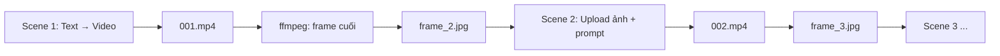

# Grok: Cắt frame cuối cảnh & dùng làm ảnh tham chiếu cảnh sau

Tài liệu này mô tả **cách tool nối các cảnh Grok** bằng cách lấy **frame cuối** của video cảnh N, lưu thành ảnh, rồi **upload lên Grok** làm đầu vào cho cảnh N+1 — giúp nhân vật / bối cảnh liên tục giữa các shot.

---

## 1. Tóm tắt luồng



| Bước | Scene đầu (mặc định) | Scene 2, 3, … |
|------|----------------------|---------------|
| Đầu vào Grok | Chỉ prompt (Imagine controls) | Upload **frame cuối** scene trước |
| Sau khi render | Tải `NNN.mp4` | Tải `NNN.mp4` |
| Hậu xử lý | `extract_last_frame_ffmpeg` → `frame_{N+1}.jpg` | Giống (trừ cảnh cuối) |

**Chế độ thay thế:** bật **ảnh tham chiếu Grok** (`grok_use_reference_image` / `use_reference_image=True`) — mỗi cảnh upload ảnh do user chọn (`grok_reference_image_url`), **không** dùng frame cuối tự động.

---

## 2. File code trong repo

| File | Vai trò |
|------|---------|
| `backend/services/grok_frame.py` | Cắt frame bằng **ffmpeg** |
| `backend/services/grok_imagine_nst.py` | `run_prompt_chain()` — vòng lặp scene, upload, cắt frame |
| `backend/services/nst_flow.py` | Gọi `run_prompt_chain` từ UI AI tab, copy video vào `videos/{script}/` |
| `backend/services/scene_sync.py` | Đồng bộ tên ảnh ref: `images_ref/.../scene_XXX.png` |

---

## 3. Code cắt frame cuối (`grok_frame.py`)

### 3.1 Hàm chính

```python
import subprocess
from pathlib import Path
from services.media_engine import FFMPEG_PATH


def extract_last_frame_ffmpeg(video_path: str) -> str:
    """
    Lấy frame gần cuối video (lùi 0.1s từ EOF) bằng ffmpeg.
    Trả về đường dẫn file .last_frame.jpg (cùng thư mục với video).
    """
    video = Path(video_path)
    output = video.with_suffix(".last_frame.jpg")

    subprocess.run(
        [
            FFMPEG_PATH,
            "-y",
            "-sseof",
            "-0.1",   # 0.1 giây trước khi hết video (tránh frame đen / lỗi EOF)
            "-i",
            str(video),
            "-frames:v",
            "1",
            str(output),
        ],
        check=True,
        stdout=subprocess.DEVNULL,
        stderr=subprocess.DEVNULL,
    )
    return str(output)


def extract_first_frame_ffmpeg(video_path: str) -> str:
    """Lấy frame đầu — dùng khi cần thumbnail / so sánh, không dùng cho chain Grok."""
    video = Path(video_path)
    output = video.with_suffix(".first_frame.jpg")
    subprocess.run(
        [FFMPEG_PATH, "-y", "-i", str(video), "-frames:v", "1", str(output)],
        check=True,
        stdout=subprocess.DEVNULL,
        stderr=subprocess.DEVNULL,
    )
    return str(output)
```

### 3.2 Tham số ffmpeg quan trọng

| Tham số | Ý nghĩa |
|---------|---------|
| `-sseof -0.1` | Seek từ **cuối file** lùi 0.1s — lấy frame ổn định gần kết thúc clip |
| `-frames:v 1` | Chỉ xuất **một** khung hình |
| `FFMPEG_PATH` | Lấy từ `media_engine` (ffmpeg bundled hoặc PATH hệ thống) |

**Gợi ý chỉnh:** nếu frame cuối bị đen / fade-out, thử `-sseof -0.5` hoặc `-1` (lùi 0.5s / 1s).

### 3.3 Chạy thử độc lập

Từ thư mục `backend`:

```bash
python -m services.grok_frame
```

Hoặc trong Python:

```python
from services.grok_frame import extract_last_frame_ffmpeg

out = extract_last_frame_ffmpeg(r"D:\path\to\001.mp4")
print(out)  # ...\001.last_frame.jpg
```

---

## 4. Logic nối cảnh trong `run_prompt_chain`

Đoạn cốt lõi (rút gọn từ `grok_imagine_nst.py`):

```python
from pathlib import Path
from services.grok_frame import extract_last_frame_ffmpeg

last_frame_path: str | None = None

for i, prompt in enumerate(prompts, start=1):
    scene_id = scene_ids[i - 1] if scene_ids else i

    if use_reference_image:
        # Mỗi scene: upload ảnh user (reference_image_by_scene[scene_id])
        await test_attach_edit_images_upload(page, ref_path, prompt, ...)
    elif scene_id <= 1:
        # Cảnh 1: không upload — chỉ controls + prompt
        await click_imagine_controls_with_options(page, ...)
        await _type_prompt_and_submit(page, prompt)
    else:
        # Cảnh 2+: upload frame cuối cảnh trước
        frame_by_scene = output_base / f"frame_{scene_id}.jpg"
        frame_input_path = (
            last_frame_path
            if last_frame_path and Path(last_frame_path).exists()
            else str(frame_by_scene)  # resume nếu đã có file từ lần chạy trước
        )
        await test_attach_edit_images_upload(page, frame_input_path, prompt, ...)

    video_path = await wait_for_download(...)  # listener CDP tải MP4

    # Cắt frame cho cảnh TIẾP THEO (scene_id + 1)
    if should_extract_next_frame:
        last_frame_raw = extract_last_frame_ffmpeg(video_path)
        final_frame = output_base / f"frame_{scene_id + 1}.jpg"
        Path(last_frame_raw).replace(final_frame)  # ghi đè nếu đã tồn tại
        last_frame_path = str(final_frame)
```

### 4.1 Quy ước tên file trong thư mục output

Thư mục mặc định khi test: `storage/grok_videos/`  
Khi chạy từ app: thư mục output của script (vd. `.../ai_custom/videos/my_script/`).

| File | Ý nghĩa |
|------|---------|
| `001.mp4`, `002.mp4`, … | Video theo `scene_id` (3 chữ số) |
| `frame_2.jpg` | Frame cuối của scene 1 → **đầu vào** scene 2 |
| `frame_3.jpg` | Frame cuối scene 2 → đầu vào scene 3 |
| `NNN.last_frame.jpg` | File tạm ffmpeg (đổi tên thành `frame_{N+1}.jpg`) |

**Lưu ý:** `frame_K.jpg` = ảnh upload cho **scene K**, không phải frame *của* scene K sau khi render (frame *sau* scene K-1 được đặt tên `frame_K.jpg`).

### 4.2 Cảnh cuối

Nếu `scene_id == max_scene_id` (hoặc vòng cuối trong list), **không** gọi `extract_last_frame_ffmpeg` — chỉ giữ video.

### 4.3 Resume (chạy lại giữa chừng)

Nếu `frame_{scene_id}.jpg` đã tồn tại trên disk nhưng `last_frame_path` trong memory trống, code ưu tiên file đó — có thể tiếp tục từ scene giữa mà không cần render lại scene trước (miễn là file frame còn đúng).

---

## 5. Upload ảnh lên Grok (scene 2+)

Hàm `test_attach_edit_images_upload`:

1. Chọn mode **Video**, resolution, ratio, duration.
2. Click **Attach** → `input[type=file]` → `set_input_files(image_path)`.
3. Chờ API `rest/app-chat/upload-file` trả `fileMetadataId`.
4. **Make Video** (Settings menu).
5. Gõ prompt và Enter.

Scene 1 dùng `click_imagine_controls_with_options` + prompt, **không** attach file.

---

## 6. Tích hợp app (AI tab)

`nst_flow.py` gọi:

```python
await run_prompt_chain(
    profile_id=pid,
    prompts=[t["prompt"] for t in tasks_for_profile],
    output_dir=specific_output_dir,
    scene_ids=[int(t["scene_id"]) for t in tasks_for_profile],
    max_scene_id=max_scene_id_overall,
    use_reference_image=use_scene_reference_images,  # từ grok_use_reference_image
    reference_image_by_scene=reference_image_by_scene,
    on_video_downloaded=_on_grok_video_downloaded,
)
```

- **`use_scene_reference_images=False` (mặc định):** chain frame cuối như mục 4.
- **`True`:** mỗi scene bắt buộc có `grok_reference_image_url` (upload trong editor); path resolve từ `images_ref/{script_stem}/scene_XXX.png`.

Callback `on_video_downloaded` **copy** (không move) MP4 sang `videos/{script_name}/{scene_id:03d}.mp4` để bước cắt frame vẫn đọc được file gốc trong `output_dir`.

---

## 7. Chạy chuỗi Grok thủ công (CLI)

Cần profile NST đã start, API key, agent URL (xem biến đầu file `grok_imagine_nst.py`).

```bash
cd backend
python -m services.grok_imagine_nst --chain --profile-id YOUR_PROFILE --prompts "cảnh 1" "cảnh 2" "cảnh 3"
```

Luồng: prompt 1 (controls) → video 1 → cắt `frame_2.jpg` → upload + prompt 2 → …

---

## 8. Yêu cầu & lỗi thường gặp

| Vấn đề | Cách xử lý |
|--------|------------|
| `ffmpeg` không tìm thấy | Kiểm tra `FFMPEG_PATH` trong `media_engine.py` / cài ffmpeg |
| `Thiếu frame đầu vào cho vòng upload` | Scene 2+ nhưng không có `last_frame_path` và không có `frame_{id}.jpg` — chạy lại từ scene 1 hoặc copy frame thủ công |
| Frame tối / fade | Tăng `-sseof` (vd. `-0.5`) trong `grok_frame.py` |
| Multi-profile | Mỗi profile chạy subset cảnh riêng; **vòng 1** mỗi profile `goto` `/imagine` sạch; vòng sau dùng **Saved** |
| Bật ảnh tham chiếu UI | Upload từng scene; backend không cắt frame chain |

---

## 9. Script cắt frame thủ công (không Playwright)

File: `scripts/grok_extract_last_frame.py`

```bash
# Từ thư mục gốc repo
python scripts/grok_extract_last_frame.py "storage/grok_videos/002.mp4"
python scripts/grok_extract_last_frame.py "storage/grok_videos/002.mp4" "storage/grok_videos/frame_3.jpg"
```

Ví dụ: video scene 2 (`002.mp4`) → ảnh đầu vào scene 3 (`frame_3.jpg`).

---

## 10. Checklist vận hành

1. Scene 1: prompt đủ mô tả nhân vật / bối cảnh (frame đầu không có ref).
2. Đợi video 1 tải xong → kiểm tra `frame_2.jpg` tồn tại và nhìn đúng khung cuối.
3. Scene 2+: prompt nên mô tả **chuyển động / hành động tiếp**, tránh mô tả lại toàn bộ ngoại hình (ảnh ref đã mang continuity).
4. Không bật **Grok ảnh tham chiếu** nếu muốn chain tự động bằng frame cuối.
5. Cảnh cuối: không cần `frame_{N+1}.jpg`.

---

*Tài liệu đồng bộ với code tại commit hiện tại; sửa `grok_frame.py` / `run_prompt_chain` thì cập nhật lại mục 3–4 cho khớp.*
